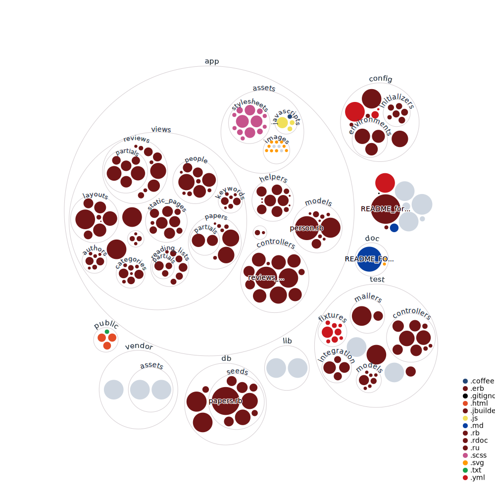

Scientific Edition in Open Access
=================================

*Old project from 2017*

---

# About
A web application aiming at automatizing the peer review process, to allow a scientific journal to be open-access.

# Workflow
* Researchers can submit their papers
* Editors propose to associate the paper with 2 or 3 researchers for peer review
* During the review process, the article is shown as 'in preparation' and can't be read
* The reviews are compared, then the article can be accepted or rejected.
* If the peer reviews are okay, the submitter can read the reviews and correct the article
* After validation of the corrections, the article is published

---

# Code

